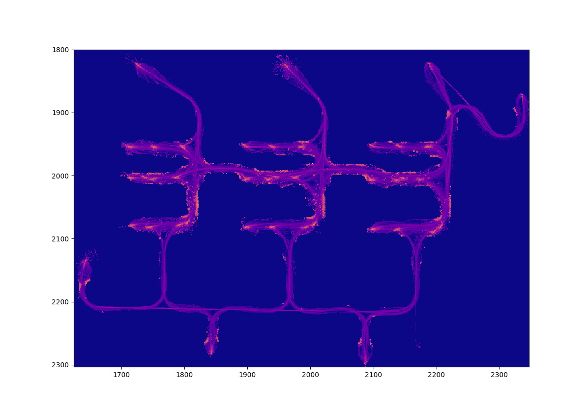

# Ebola Project Neural Network
## Overview
This uses the etu_1_condensed dataset from the [ebola data analysis repo](https://github.com/sagekg/ebola_project_data_analysis) (dataset isn't actually there because it was too much) in order to train a relatively simple convolutional neural network to predict how "hard" any given area on a map will be to navigate.

## Generate Variances
The first step of this prcoess is [generate_variances.py](generate_variances.py), which takes the original dataset and builds up a list of how long each path spent in any given pixel of the image, interpolating the data at 100 points in between actual data points. From there it calculates 3 heatmaps from that data: a heatmap of mean times spent, of median times, and of the standard deviation of the times spent in each cell.

## Make Training Dataset
[make_nn_dataset.py](make_nn_dataset.py) decomposes this dataset into squares to make it easier to train our neural net. The ouput of this is essentailly what you would expect as an output of a convolution layer of a neural net if the kernel size were (128,128) and the stride were 1. It saves an two arrays, one of input data, which is just all of the 128x128 windows in a list, and then one of the outputs, which is the value of the standard deviation heatmap at the center of the window. 

Some notes:
1. When it runs outside of the edge of the map, it puts all outside areas in as walls
2. It only adds training data to this list if the heatmap has a nonzero value or it is next to somewhere with a nonzero value

## ConvNet
The meat of this repo is in [conv_net1.py](conv_net1.py), which is where the actual model is set up and trained. I used the keras sequential api for this, with the following layers:

1. Max Pooling (2,2): This layer is mostly just there to speed up training because using 60000 128x128 images can be pretty rough, and we don't need all of that detail.
2. Conv2D (64 neuron, (4,4) kernel, (2,2) stride)
3. Dropout (.1)
4. Conv2D (32 neuron, (2,2) kernel, (2,2) stride)
5. Dropout (.1)
6. Max Pooling (2, 2):
7. Flatten (this may or may not be necessary)
8. Dense (500)
9. Output (Dense, 1 neuron)

This model has a loss/accuracy plot as follows:

## Predict from Model
[predict_from_model.py](predict_from_model.py) loads up some data and the model that was saved from conv_net1.py and uses that to try and predict what the standard deviation heatmap should be. 

When run on the original training map:
The actual standard deviations:

The model's predictions:

New map that was tested on:

The model's prediction for this new map:

## Future Work
While this neural net isn't terrible, and proves that it should be possible to predict map hardnesses based on the walls, it could benefit from a number of improvemnets:

1. More training data! This is currently only trained on the one map we have data for, so more maps of sim data would make a huge improvement
2. Rotating input images. Currently it only understands maps that are in line with the x-y axes of the image. Randomly rotating the training data could help with this issue. It would also be easier to do this in PyTorch, so it could be worth translating this to that library from keras.
3. Varying resolutions. Currently this is only trained on maps with a resolution of .05 meters/px. It would be good to either make sure that all incoming maps are at that resolution or that it has an architecture that can handle varying resolutions (which might not be possible/worthwhile)

## Requirements (or at least what I used)
* keras 2.2.2
  * tensorflow 1.9.0
  * CUDA 9.0
  * CUDNN 7.0
* scikit-learn (sklearn) 0.19.2
* scikit-image (skimage) 0.14.0
* numpy 1.15.0
* matplotlib 2.2.2
* Python Image Library (PIL) 1.1.7
* tqdm 4.24.0
* argparse 1.1
